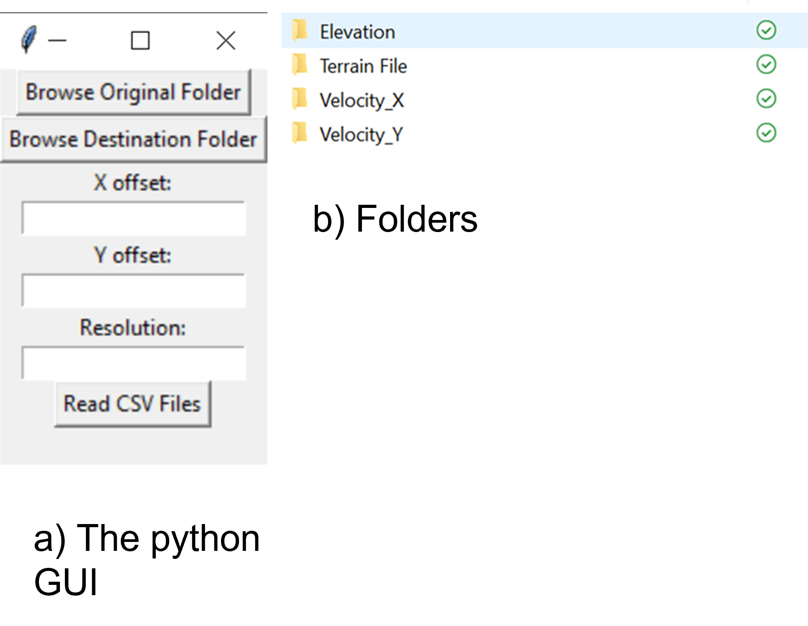
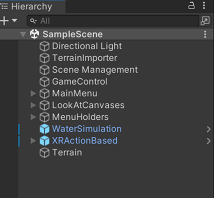
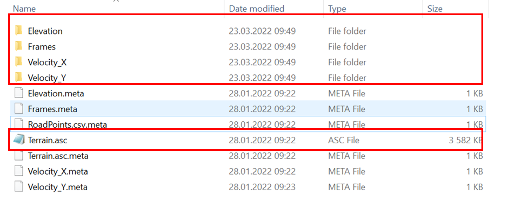
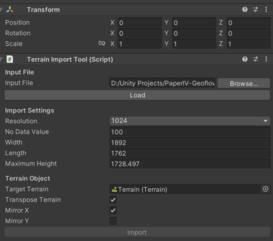
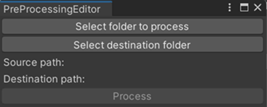
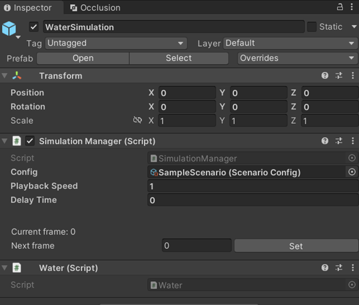
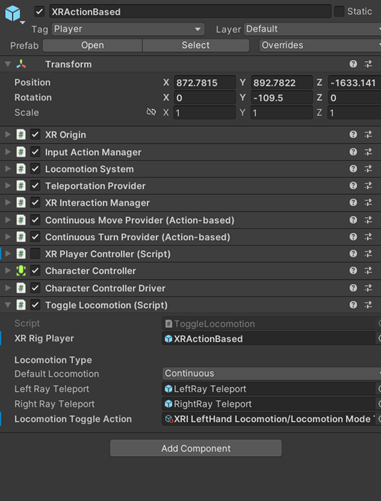
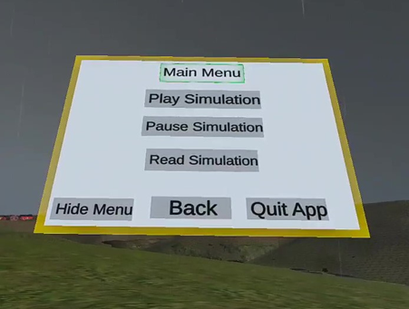

# Geophysical-flows-in-VR
This Github contains the UNITY project and files and the Python scripts to suplement the to the paper titled “Virtual Reality Visualization of Geophysical Flows: A framework “. 
## 1. Python Scripts 
This folder contains 3 python scripts namely Read_CSV_2D, Read_CSV_3D, and ConcaveHull.py. To use these scripts, one has to use Anaconda distribution (see https://www.anaconda.com/ ) and install all necessary python packages. In addition, the ConcaveHull.py should be always in the same folder with Read_CSV_3D.py and imported as a packaged. We enabled a user to use a simple GUI to manage the input files and output folder. Running either of the Read CSV scripts prompts the user to enter the original folder which contains the CSV files and the destination folder (it should be created before running) in which the preprocessed ASCII files are going to be placed. After the end of running the python scripts, the contents of the destination folder should be like that as shown in figure b below. 
In many occasions numerical models use their own coordinate system, for example making the origin of the computation domain at the center of it. This creates discrepancy with the GIS coordinate systems in case the user needs to see the ASCII files in any of the GIS tools. Here, we use the X and Y offset inputs. One can use, zero if he/she needs to check the results in GIS tools.  The number of grids of the ASCII files will be controlled by the resolution input.  We have used X-offset = 612907.50, Y offset =6658839.00 and Resolution 2 for 3D CSV files. Similarly, for the 2D CSV samples, X-offset = 481270, Y offset =6746670 and Resolution 2 can be used. 

 ## 2. Unity project 
This is a sample Unity project based on which the Unity Build is made.This is a sample Unity project based on which the Unity Build is made. It can be opened in Unity 2021.3 or more recent versions.  
  There are four scenes in the project three of which are similar with ones presented in the journal paper. The only difference is that some of the assets are stripped off for copy right reasons.  The fourth one is a sample scene based on which one can build a new one. Four of the scenes are located under Assets->breach->Scenes->DynamicScenes. Below shows the components of the sample scene. 

 ## 2.1 Pre-processing Module 
Before stating working with the pre-processing module, one needs to organize the data into a format 
that the pre-process module can work with. There are 4 required components that need to be in the same parent folder:

      - Elevation Directory
      - Velocity_X Directory
      - Veloity_Y Directory
      - Terrain.asc File
      - Frames directory

Below is an example of a directory setup for being preprocessed.

# 2.1.1. Import Terrain 

To import the terrain on which the geophysical flow occurred:
    -	select the “TerrainImporter” game object 
    -	Next, click on Browse, and navigate to the terrain file. Note that currently only .asc files are supported.
    -	Click on Load to load the terrain data. This can take some time.
    -	The fields below, such as Width, Length, and Maximum Height will get populated automatically depending on the terrain data. Only change these if you know what you are doing. You may decrease the Resolution if you wish to decrease the accuracy while improving performance.
    -	Select the Target Terrain to import data into.
    -	If necessary, enable mirroring along diagonal (Transpose) or either of the axes (Mirror X, Mirror Y)
    -	Click Import. If the result is incorrect (e.g. flipped along the diagonal) modify the import setting above and try again.

# 2.1.2. Import flow 
To import the flow data, you can now navigate in the Unity project to Window -> WoWW -> Pre-processing. 
The following window will be displayed. 

    -	Select folder to process: - Select the parent folder of the 4 components, as explained above.
    -	Select destination folder: - Select the folder where pre-processed data should be stored. Use <Project>/Assets/StreamingAssets/SceneData/<Scene>/Frames.
    -	Click Process and wait. Note that this operation can take some time depending on the size and amount of data and will use all your available CPU resources.
At the end of this step, you will have binary file inside the “Frames” folder. 

# 2.2. Simulation Module 

To set up the simulation module, follow the following steps:
    -	Set up a scenario by navigating to Assets->Breach->Scenarios and click on Sample Scenario
    -	Add multiple variations if relevant (for this case only one)
    -	Add path, the path should be a relative path from within Assets/StreamingAssets/SceneData
    -	Add the flow-material for this simulation.
    -	Next, select the “WaterSimulation” game object. 
    -	Find it and add the Sample Scenario to the Config
    -	In the playback speed, use the interval (time steps) you used in your numerical simulation. For example, if you saved your CSV file every one second use one, if every 20 seconds use 20 seconds for realistic simulation. 
At the end of this step, the project is already set up and ready to include the interactions. 

# 2.3.Interaction Module 

The interaction module contains the XR rig and several UI elements. 
The main center interaction is XRActionBased game object.  
You do not need to change anything on this game object. Of course you can change anything if you know what you are doing. 

The UI, `MainMenu` contains Buttons with which a user interacts virtual environment. 

## 3.Unity Build 
This folder contains the already built Unity applications that can be played via Oculus Quest 2 and VR compatible Computer.
To play this application: 
  - Prepare the Oclus Quest 2 and make sure that the 'Menu button' on the left hand controller is functioning as a menu button.
some times the Menu (left hand) and Oclus(right hand) buttons exchange their functions. Check this on the settings of the Oclus Quest 2. 
  
  - Connect the Oclus Quest 2 with a VR compatible PC. 
  - Open the .exe application files from one of the folders from within Bunit Build folder
  - Follow the instructions: 
      - You have the left hand and right hand controllers. The joystick on the left hand will help you to move forward, backward and to the side depending on 
       how you push it. The default mode of movement is continuous. You can change to teleport mode by pressing down it. To change it back to continuous mode press it domn again.  The joystick on the right hand controller is 
        for rotation 
      - The Menu button on the left hand controller is for showing and hiding the menu described above. press it for the first time and the Main mane will be displayed.
       you can choose any interaction such as playing and pausing the simulation, reading simulation values or quit the application. You can select and click on the buttons using the trigger button from either of the controllers.
      - After you click on the read simulation button, you click the trigger button on the right hand controller pointing into the flow and the results will be showed on the left hand controller. You need to click it once to see the
       results and click it again to let it disappear and start again to read the next result. To leave the read simulation, you need to click on the 'Cancel' buttun. 
 
## 4. Sample CSV file 
This folder contains sample CSV files of 2D and 3D simulation results. In both of the CSV file folders, the first 3 columns are X, Y, and Z coordinates, the next three columns are velocities in X, Y and Z directions. The seventh column in the 2D CSV files is the flow height and in the 3D CSV files it is the interface variable. Both the python scripts are created based on such data structures. In case there are different structures, a user can modify the python scripts at lines 165-174 in the Read_CSV_2D.py and lines 141-158 in the Read_CSV_3D.py scripts. 

